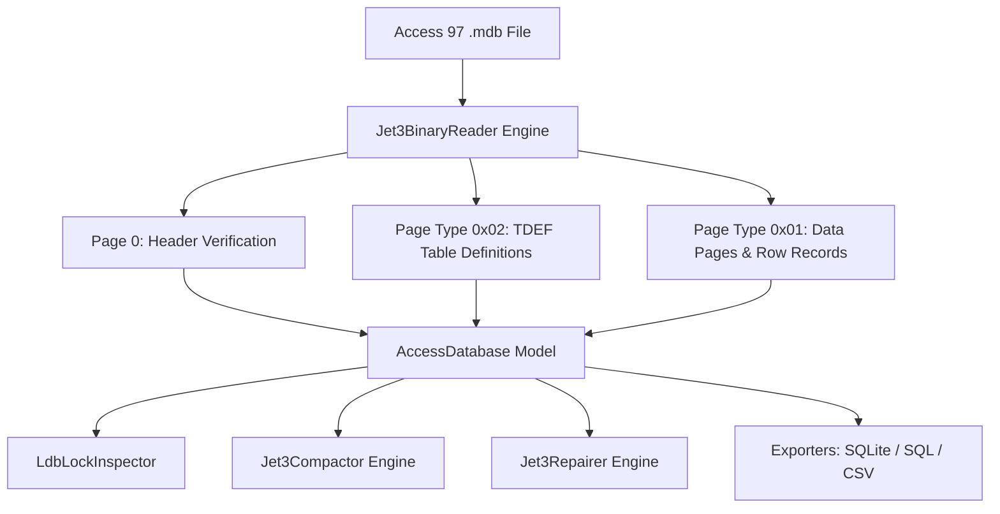

# 01 - Introduction & Architecture

Welcome to the **AccessUtility** learning guide series! This documentation breaks down how legacy **Microsoft Access 97 (`.mdb` / Jet 3.5)** database files are structured and how this tool operates natively on modern 64-bit systems without legacy Office drivers.

---

## 💡 The Problem with Access 97 Files Today

Microsoft Access 97 databases were created using the **Jet 3.5 Database Engine**. 
- Modern 64-bit Windows operating systems and 64-bit Microsoft Office / ACE OLEDB drivers **no longer support opening, compacting, or repairing Jet 3.5 databases**.
- Legacy 32-bit `Microsoft.Jet.OLEDB.4.0` drivers cannot be loaded directly into 64-bit processes.
- Access 97 files frequently suffer from file size bloat (deleted record slack space), broken lock files (`.ldb`), and page header corruption.

---

## ⚡ The Solution: Pure C# Native AOT Engine

**AccessUtility** solves this problem by parsing the binary byte layout of Access 97 `.mdb` files directly in pure C#, compiled into a single **Native AOT** executable with **zero runtime dependencies**.

---

## 📄 Jet 3.5 Binary Page Layout (2048 Bytes / Page)

Every Access 97 database file consists of contiguous **2048-byte (2 KB)** pages:

| Offset Range | Page Type | Purpose |
| :--- | :--- | :--- |
| **Page 0** | Header Page | Contains Jet magic string `"Standard Jet DB\0"` and engine version byte (`0x01` = Jet 3.5). |
| **Page 1** | PAM (Page Allocation Map) | Tracks allocated vs free pages across the database. |
| **Page Type `0x02`** | TDEF (Table Definition) | Defines table name, column count, column names, data types, fixed offsets, and variable indices. |
| **Page Type `0x01`** | Data Page | Stores row records, fixed fields, null masks, variable-length ANSI text, and record slot pointers. |

---

## Next Step
Continue to [02 - Lock File (.ldb) Inspector Guide](02-lock-file-inspector-guide.md) to learn how `.ldb` lock files work and how to clean up stale locks safely.
