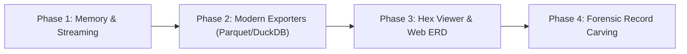

# 09 - Recommendations & Future Roadmap

This document outlines architectural reviews, performance optimizations, forensic capabilities, and feature expansion recommendations for **AccessUtility**.

---

## 🎯 Executive Summary

AccessUtility has achieved a strong foundation with **.NET 10 Native AOT**, zero COM dependencies, and a multi-interface design (CLI, TUI, Web UI). To evolve the tool into an enterprise-grade migration and forensic utility, the following strategic improvements and feature enhancements are recommended.

---

## 🏗️ 1. Performance & Memory Optimizations

### 1.1 Zero-Copy Parsing with `MemoryMappedFile` & `ReadOnlySpan<byte>`
- **Current Behavior**: Reads the entire `.mdb` database into heap memory via `File.ReadAllBytes()` or `byte[]` buffers.
- **Limitation**: Large legacy databases approaching the 1GB–2GB boundary allocate significant contiguous memory on the Large Object Heap (LOH).
- **Recommendation**:
  - Implement memory-mapped file access (`System.IO.MemoryMappedFiles.MemoryMappedFile`).
  - Pass `ReadOnlySpan<byte>` slices into page parsing routines (`Jet3BinaryReader.ParsePage()`) to achieve zero heap allocations during binary scanning.

### 1.2 Streaming Record Iteration
- **Current Behavior**: Materializes all table rows into memory before passing them to exporters.
- **Recommendation**: Introduce `IEnumerable<AccessRow>` or `IAsyncEnumerable<AccessRow>` streaming iterators to export multi-million row tables directly to disk without memory accumulation.

---

## 🔬 2. Forensic & Data Recovery Enhancements

### 2.1 Raw Record & Deleted Row Carving
- **Opportunity**: Jet 3.5 databases do not immediately overwrite deleted rows; they merely mark slots as free or leave unallocated slack space within data pages (`0x01`) and free pages (`0x00`).
- **Feature**: Add a forensic record carver (`AccessUtility.exe repair --carve-deleted`) that scans unallocated page bytes for valid column signatures and salvages dropped or truncated records.

### 2.2 Jet 4.0 (Access 2000–2003) & ACE (.accdb) Auto-Detection
- **Opportunity**: Users often encounter mixed-generation Access files.
- **Feature**:
  - Detect 4096-byte page sizes and Jet 4.0 / ACE header signatures (version bytes `0x02`, `0x03`, `0x1B`).
  - Provide immediate version diagnostics, compatibility reports, and clear migration guidance.

---

## 📊 3. Modern Data Pipeline Exporters

Expand the `Exporters/` subsystem with modern analytical and big-data target formats:

| Format | Target Use Case | Benefit |
| :--- | :--- | :--- |
| **Apache Parquet (`.parquet`)** | Data Lakes, AWS S3, Spark, Databricks | Columnar compression and fast analytical query performance. |
| **DuckDB (`.duckdb`)** | Local OLAP analytics, modern data engineering | Zero-server SQL engine directly querying migrated datasets. |
| **NDJSON / JSON Lines (`.jsonl`)** | Streaming ETL, Elasticsearch, OpenSearch | Line-delimited streaming ingestion for log and search engines. |
| **Mermaid ERD (`.md`)** | Schema documentation, visual modeling | Automatic Entity-Relationship Diagram generator. |

---

## 🖥️ 4. Web Dashboard & UI Visualizer Upgrades

Enhance the embedded Web UI (`AccessUtility.exe web --port 5000`):

1. **Interactive Page Map (Sector Map)**:
   - Visual colored grid representing every 2048-byte page: Header (`0x00`), PAM (`0x01`), TDEF (`0x02`), Data (`0x01`), Slack/Free (`0x00`), and Corrupted sectors.
2. **Integrated Hex & ASCII Viewer**:
   - Click any page on the sector map to inspect raw binary data with column and record offset overlays.
3. **Interactive ERD Schema Viewer**:
   - Visual schema graph rendering table relationships, primary keys, and field types in real time.

---

## 🛡️ 5. Security & Enterprise Hardening

1. **Strict Localhost Binding**: Default embedded web server listener strictly to `http://127.0.0.1:<port>` unless explicit `--host 0.0.0.0` is provided.
2. **Safe Path Normalization**: Enforce path sanitization on all export and repair destination paths to prevent directory traversal.
3. **Headless Container Mode (Docker & CI/CD)**: Provide an official multi-arch Linux/Windows container image for seamless integration into automated Airflow / Dagster ETL pipelines.

---

## 🗺️ Suggested Implementation Roadmap

---

## ⏩ Navigation
- ⬅️ **Previous:** [08 - SQLite Log Viewer Guide](08-log-viewer-guide.md)
- ➡️ **Next:** [10 - Phase 1: Memory & Streaming Optimizations](10-phase1-memory-and-streaming.md)
- 🔄 **Return to Start:** [00 - Beginner's Guide to AccessUtility](00-beginner-guide.md)
