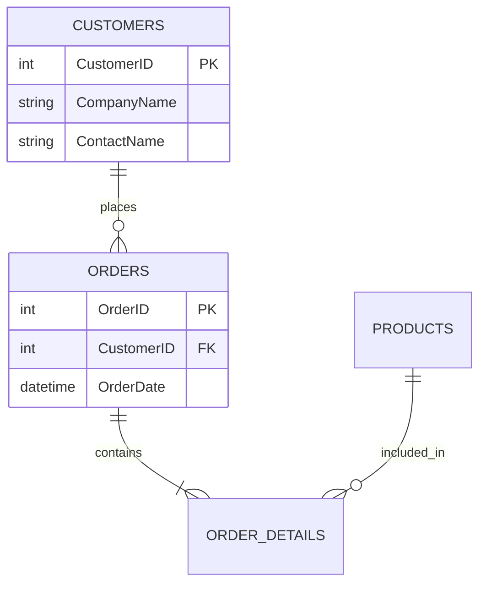

# 12 - Phase 3: Web Dashboard Visualizer & ERD Diagrams

This guide outlines the technical implementation details for **Phase 3: Web Dashboard Visualizer, Hex Inspector, and Schema ERD Diagrams** in AccessUtility.

---

## 🎯 Goal & Problem Statement

Database diagnostics and schema analysis often require deep visibility into low-level page layouts and relationships between tables. Command-line text outputs can be difficult to interpret when analyzing heavily fragmented or damaged databases.

Phase 3 enhances the embedded Web UI (`AccessUtility.exe web --port 5000`) with:
1. **Interactive Database Sector/Page Map**: Real-time visual color-coded grid of all 2048-byte pages.
2. **Integrated Hex & ASCII Page Inspector**: Inspect raw bytes of any page with field-level annotations.
3. **Automated Entity-Relationship Diagram (ERD)**: Interactive Mermaid / SVG schema viewer.

---

## 🎨 UI Architecture & Components

```
+─────────────────────────────────────────────────────────────────────────────+
|                         AccessUtility Web Dashboard                         |
+─────────────────────────────────────────────────────────────────────────────+
| [Overview]  [Schema & Tables]  [Sector Map]  [Hex Inspector]  [ERD Graph]   |
+─────────────────────────────────────────────────────────────────────────────+
|  Sector Map: Total Pages = 1,024  (2,048 KB)                                |
|  [■ Header 0] [■ PAM 1] [■ TDEF 2] [■ DATA 3..40] [■ SLACK 41..100] ...     |
+─────────────────────────────────────────────────────────────────────────────+
|  Selected: Page 2 (TDEF - Table 'Employees')                                |
|  Offset  00 01 02 03 04 05 06 07  08 09 0A 0B 0C 0D 0E 0F   ASCII           |
|  000000  02 01 00 00 54 44 45 46  14 00 00 00 08 00 00 00   ....TDEF........|
|  000010  45 6D 70 6C 6F 79 65 65  73 00 00 00 00 00 00 00   Employees.......|
+─────────────────────────────────────────────────────────────────────────────+
```

---

## 💻 Implementation Details

### 1. Page Map REST API (`/api/pages`)
Add an endpoint in [`WebServer.cs`](file:///E:/Workspace/Dev/Tool/access-utility/Web/WebServer.cs) returning page classification types:

```json
[
  { "page": 0, "type": "Header", "status": "Valid", "description": "Jet 3.5 Signature" },
  { "page": 1, "type": "PAM", "status": "Valid", "description": "Page Allocation Map" },
  { "page": 2, "type": "TDEF", "status": "Valid", "description": "Table: Customers" },
  { "page": 3, "type": "Data", "status": "Valid", "description": "Table: Customers (24 rows)" },
  { "page": 4, "type": "Slack", "status": "Free", "description": "Unallocated space" }
]
```

### 2. Hex Inspector API (`/api/pages/{pageIndex}/hex`)
Returns base64 or formatted hex + ASCII view of the exact 2048-byte page:

```csharp
app.MapGet("/api/pages/{pageIndex:int}/hex", (int pageIndex, string path) =>
{
    var reader = new Jet3MemoryReader(path);
    var pageBytes = reader.GetPage(pageIndex).ToArray();
    return Results.Ok(new
    {
        PageIndex = pageIndex,
        HexLines = FormatHexLines(pageBytes)
    });
});
```

### 3. Schema ERD Generation (`Mermaid & SVG`)
Extract foreign keys and primary keys from TDEF metadata to automatically render Mermaid ERD syntax:



---

## 🖥️ CLI Integration

You can also export ERD diagrams directly from the CLI to markdown files:

```bash
AccessUtility.exe diff sample97.mdb --format erd --output ./schema_diagram.md
```

---

## ⏩ Navigation
- ⬅️ **Previous:** [11 - Phase 2: Modern Analytical Exporters](11-phase2-modern-exporters.md)
- ➡️ **Next:** [13 - Phase 4: Forensic Record Carving](13-phase4-forensic-carving.md)
- 🔄 **Return to Start:** [00 - Beginner's Guide to AccessUtility](00-beginner-guide.md)
